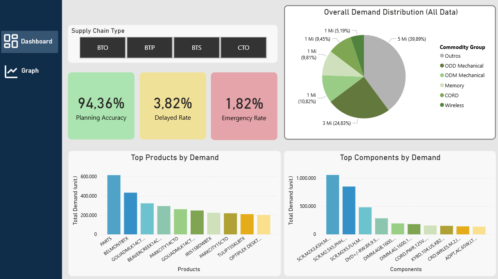
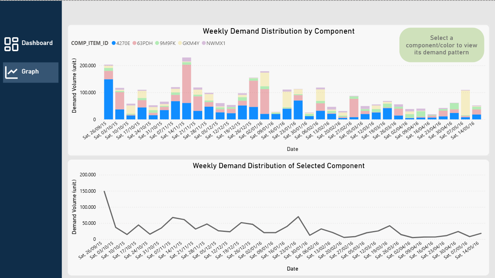

# Análise de Supply Chain — Avaliação do Planejamento de Estoque
## Visão Geral
Este projeto apresenta uma Análise Exploratória de Dados (EDA) de um dataset de planejamento de estoque, com o objetivo de avaliar a consistência, o comportamento e os padrões operacionais do processo de reposição.

Dataset utilizado: https://www.kaggle.com/datasets/veeralakrishna/inventory

----------------------

## Objetivos
A análise foi estruturada para responder às seguintes perguntas:
*O planejamento é consistente com o lead time?
* As demandas são estáveis ou variáveis? O quão estáveis ou variáveis, são?
* É possível identificar componentes críticos?
* Estratégias de produção diferentes apresentam comportamentos distintos?
* Há tendências ou padrões ao longo do tempo?

----------------------

## Ferramentas utilizadas
* Python (Pandas, Matplotlib) para análise e visualização de dados
* SQL (DuckDB) para consultas e agregações
* Jupyter Notebook como ambiente de desenvolvimento
* Power BI para visualização dos resultados

----------------------
## Arquivos disponíveis
* Notebook Completo ipynb: A análise detalhada, incluindo tratamento dos dados, gráficos e construção dos insights.
* Dashboard pbix: Desenvolvido para visualização dos principais indicadores e padrões identificados.

----------------------

## Tratamento dos dados
Durante o processamento, foram realizadas:

* Padronização de datas
* Organização da relação entre planejamento e demanda
* Criação de uma classificação operacional:
  * Dentro do plano (On Schedule) → atende ao lead time
  * Atrasado (Delayed) → planejado antes, mas com tempo insuficiente
  * Correção emergencial (Emergency) → planejado após a demanda
  * Indefinido (Undefined) → dados inconsistentes (que não houveram) 

----------------------

## Principais insights
* Consistência do planejamento
* Aproximadamente 94% das demandas estão dentro do plano
* Indica forte aderência ao lead time e boa organização operacional
* Comportamento operacional
  * Os dados sugerem um processo rotineiro e recorrente
  * Indícios de operação em ciclos (possivelmente semanais ou por lote)
* Alta presença de registros com quantidade zero
  * Evidências indicam que fazem parte da rotina operacional, não de demanda real
* Variabilidade da demanda
  * Alguns componentes apresentam picos recorrentes elevados
  * Indica existência de itens críticos ou eventos específicos

